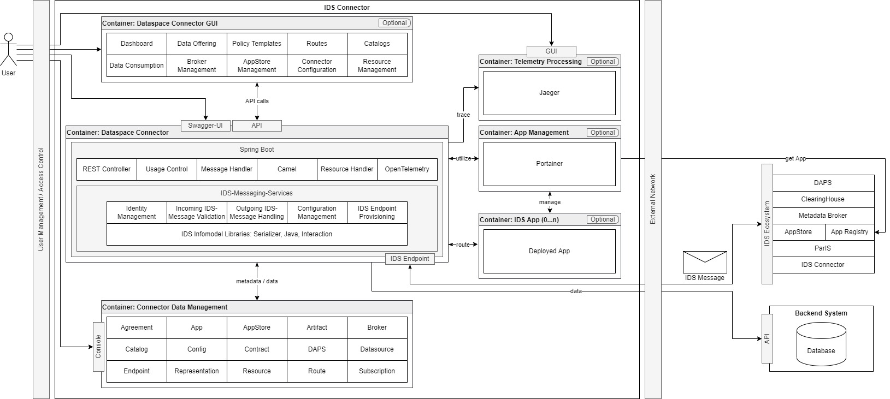

<h1 align="center">
  <br>
    
  <br>
      Dataspace Connector
  <br>
</h1>


<p align="center">
  <a href="#contributing">Contribute</a> •
  <a href="https://international-data-spaces-association.github.io/DataspaceConnector/">Docs</a> •
  <a href="https://github.com/International-Data-Spaces-Association/DataspaceConnector/issues">Issues</a> •
  <a href="#license">License</a>
</p>

The Dataspace Connector is an implementation of an IDS connector component following the
[IDS Reference Architecture Model](https://www.internationaldataspaces.org/wp-content/uploads/2019/03/IDS-Reference-Architecture-Model-3.0.pdf).
It integrates the [IDS Information Model](https://github.com/International-Data-Spaces-Association/InformationModel)
and uses the [IDS Messaging Services](https://github.com/International-Data-Spaces-Association/IDS-Messaging-Services)
for IDS functionalities and message handling.
The core component in this repository provides a REST API for loading, updating, and deleting
resources with local or remote data enriched by its metadata. It supports IDS conform message
handling with other IDS connectors and components and implements usage control for selected IDS
usage policy patterns.

***

<h3 align="center" >
  <a href="https://international-data-spaces-association.github.io/DataspaceConnector/">
    D O C U M E N T A T I O N
  </a>
</h3>

***

## Quick Start

The official Docker images of the Dataspace Connector can be found
[here](https://github.com/International-Data-Spaces-Association/DataspaceConnector/pkgs/container/dataspace-connector).

For an easy deployment, make sure that you have [Docker](https://docs.docker.com/get-docker/)
installed. Then, execute the following command:

```commandline
docker run -p 8080:8080 --name connector ghcr.io/international-data-spaces-association/dataspace-connector:latest
```

If everything worked fine, the connector is available at
[https://localhost:8080/](https://localhost:8080/). The API can be accessed at
[https://localhost:8080/api](https://localhost:8080/api). The Swagger UI can be found at
[https://localhost:8080/api/docs](https://localhost:8080/api/docs).

For certain REST endpoints, you will be asked to log in. The default credentials are `admin` and
`password`. **Please take care to change these when deploying and hosting the connector yourself!**

For a more detailed explanation of deployment and configurations, see
[here](https://international-data-spaces-association.github.io/DataspaceConnector/Deployment).

Next, please take a look at our
[communication guide](https://international-data-spaces-association.github.io/DataspaceConnector/CommunicationGuide).

**Note**:
For a more detailed or advanced Docker or Kubernetes deployment, as well as a full setup with the
Connector and its GUI, see [here](https://github.com/International-Data-Spaces-Association/IDS-Deployment-Examples/tree/main/dataspace-connector).
If you want to build and run locally, follow [these](https://international-data-spaces-association.github.io/DataspaceConnector/GettingStarted#local-build) steps.


### Security and Verification

The Docker images are signed using [cosign](https://github.com/sigstore/cosign).
The public key of the Dataspace Connector can be found at the root of the project structure
([here](https://github.com/International-Data-Spaces-Association/DataspaceConnector/blob/main/dsc.pub)).

For verifying that you have received an official image from a trusted source, run:

```commandline
cosign verify --key dsc.pub ghcr.io/international-data-spaces-association/dataspace-connector:latest
```

### Software Bill of Material (SBoM)

The Software Bill of Material (SBoM) for every Docker image is supplied as
[SPDX-JSON](https://spdx.org/licenses/JSON.html) and can be found by appending `-sbom` to the
image tag. For example, the SBoM for `ghcr.io/international-data-spaces-association/dataspace-connector:latest`
is `ghcr.io/international-data-spaces-association/dataspace-connector:latest-sbom`.

The SBoM can be pulled via tools like [oras](https://github.com/oras-project/oras).

```commandline
oras pull ghcr.io/international-data-spaces-association/dataspace-connector:latest-sbom -a
```

**Note**: Also the SBoM images can be validated using [cosign](https://github.com/sigstore/cosign)
as shown [above](#security-and-verification).

### Database Migration

Before updating to a new major release, please read
<a href="https://international-data-spaces-association.github.io/DataspaceConnector/Deployment/DatabaseMigration">this</a>
guide!

### Connector Components Overview

The container architecture of the entire IDS Connector is made up of several components. Some of them are optional. At the center is the Dataspace Connector itself (connector core) with its connector data management. Optionally, the Dataspace Connector GUI can be used. Jaeger can be connected for displaying collected OpenTelemetry data. For the integration of IDS-Apps into the connector infrastructure, Portainer can be used to load IDS-Apps from an IDS-AppStore-Registry and manage them in the infrastructure. The actual data can be located both locally and externally. External IDS-Ecosystem components can be reached via IDS-Messages.



## IDS Ready & IDS Sandbox

The Dataspace Connector is IDS ready and approved for IDS graduation scheme.

<a href="https://internationaldataspaces.org/ids-ready-open-source-software-dataspace-connector-enables-sovereign-data-exchange/" target="_blank"></a>
<a href="https://github.com/International-Data-Spaces-Association/idsa/blob/main/graduation_scheme/Projects.md" target="_blank"></a>

## Contributing

You are very welcome to contribute to this project when you find a bug, want to suggest an
improvement, or have an idea for a useful feature. Please find a set of guidelines at the
[CONTRIBUTING.md](CONTRIBUTING.md) and the [CODE_OF_CONDUCT.md](CODE_OF_CONDUCT.md).

The current development is driven by
* [Sebastian Opriel](https://github.com/SebastianOpriel), [sovity GmbH](http://sovity.de)
* [Tim Berthold](https://github.com/tmberthold), [sovity GmbH](http://sovity.de)
* [Omar Silva](https://github.com/omarsilva1), [sovity GmbH](http://sovity.de)

The former core development was driven by
* [Heinrich Pettenpohl](https://github.com/HeinrichPet), [Fraunhofer ISST](https://www.isst.fraunhofer.de/en.html), project manager
* [Julia Pampus](https://github.com/juliapampus), [Fraunhofer ISST](https://www.isst.fraunhofer.de/en.html), lead developer
* [Brian-Frederik Jahnke](https://github.com/brianjahnke), [Fraunhofer ISST](https://www.isst.fraunhofer.de/en.html)
* [Ronja Quensel](https://github.com/ronjaquensel), [Fraunhofer ISST](https://www.isst.fraunhofer.de/en.html)

with significant contributions, comments, and support by (in alphabetical order):
* [Erik van den Akker](https://github.com/vdakker), [Fraunhofer ISST](https://www.isst.fraunhofer.de/en.html)
* [Fabian Bruckner](https://github.com/fabianbruckner), [Fraunhofer ISST](https://www.isst.fraunhofer.de/en.html)
* [Gökhan Kahriman](https://github.com/goekhanKahriman), [Fraunhofer ISST](https://www.isst.fraunhofer.de/en.html)
* [Haydar Qarawlus](https://github.com/hqarawlus), [Fraunhofer ISST](https://www.isst.fraunhofer.de/en.html)
* [Johannes Pieperbeck](https://github.com/jpieperbeck), [Fraunhofer ISST](https://www.isst.fraunhofer.de/en.html)
* [Michael Lux](https://github.com/milux), [Fraunhofer AISEC](https://www.aisec.fraunhofer.de/en.html)
* [René Brinkhege](https://github.com/renebrinkhege), [Fraunhofer ISST](https://www.isst.fraunhofer.de/en.html)
* [Steffen Biehs](https://github.com/steffen-biehs), [Fraunhofer ISST](https://www.isst.fraunhofer.de/en.html)

## License
Copyright © 2020-2022 [Fraunhofer ISST](https://www.isst.fraunhofer.de/en.html).
This project is licensed under the Apache License 2.0 - see [here](LICENSE) for details.
